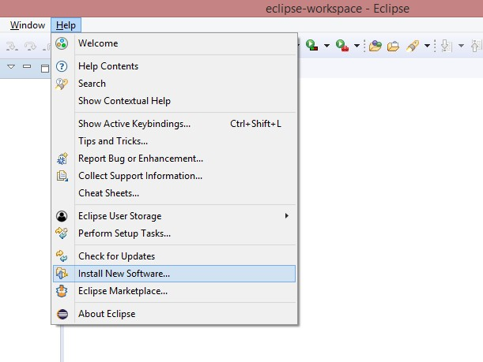
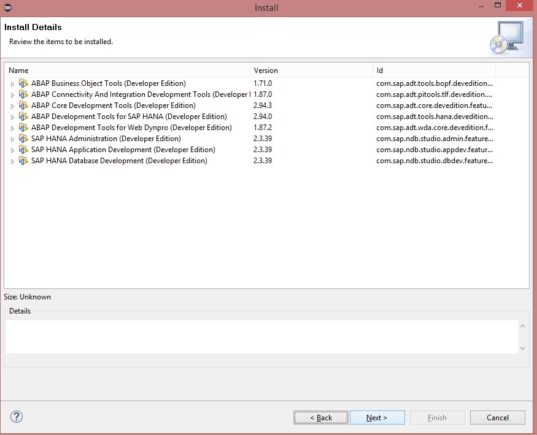

#Pré-Requisitos

&nbsp;
### 1 - Instalação versão mais recente
&nbsp;

No site [SAP Development Tools](https://tools.hana.ondemand.com/#abap) a SAP disponibiliza o procedimento para instalação da versão mais recente estável do Eclipse com ADT (**ABAP Development Tools**). As versões mais recentes do Eclipse utilizam JRE 11, portanta caso tenha problemas com essa versão ou alguma incompatibilidade, use a versão Oxygen do Eclipse com o JAVA JDK 8.

Se utilizar a versão disponibilizada no SAP Development Tools, ignore os passos 2 e 3.

&nbsp;
### 2 - Instalação do JAVA 8 JDK
&nbsp;

&nbsp;
### Windows
&nbsp;

Acesse o site da Oracle e instale o [Java JDK 8](https://www.oracle.com/br/java/technologies/javase/javase-jdk8-downloads.html) (instalar o update mais recente, desde que seja Java 8. Atentar ao fato que é preciso instalar o JDK e não o JRE, e o Java precisa estar na versão 8 (versões anteriores não servem).

Após a instalação, verifique se existe a variável de sistema JAVA_HOME e se ela está apontando para o diretório de instalação do seu Java JDK.

&nbsp;
{: .center}

{: .center}

{: .center}

{: .center}
&nbsp;

&nbsp;
## 3 - Instalação do Eclipse
&nbsp;

Para instalação do Eclipse é preciso ter o JAVA instalado previamente.

&nbsp;
### Windows
&nbsp;

Acesse o site do [Eclipse](http://www.eclipse.org/oxygen/) e faça download do [Eclipse Oxygen 4.7](https://www.eclipse.org/downloads/download.php?file=/oomph/epp/oxygen/R2/eclipse-inst-win64.exe)

Instale a opção "Eclipse IDE for Java Developers"

&nbsp;
{: .center}
&nbsp;

&nbsp;
## 4 - Instalação do ADT (ABAP Development Tools)
&nbsp;

&nbsp;
### Windows
&nbsp;

Os passos a seguir estão descritos no site [SAP Development Tools ABAP](https://tools.hana.ondemand.com/#abap) para instalar o plugin ADT (ABAP Development Tools) no Eclipse Oxygen.

* Abra o Eclipse Oxygen; 

* Vá em _**Help>Install New Software..**_;

&nbsp;
{: .center}
&nbsp;

* Se tiver usado a versão do SAP Development Tools, adicione o repositório informado no site da SAP. Caso tenha usado a versão do Eclipse Oxygen, adicione o repositório **https://tools.hana.ondemand.com/oxygen** e pressione **Enter**;

&nbsp;
{: .center}

{: .center}

{: .center}
&nbsp;

* Marque as opções **ABAP Development Tools** e **SAP HANA Tools** e clique em **Next**;

&nbsp;
{: .center}
&nbsp;

* Clique novamente em **Next**, aceite os termos de licença e clique em **Finish**;

&nbsp;
{: .center}

{: .center}
&nbsp;

* O Eclipse vai começar a baixar e instalar os Plugins de ABAP e de HANA; 

&nbsp;
{: .center}
&nbsp;

* Caso apareça algum warning, basta clicar em Install **Anyway**;

&nbsp;
{: .center}
&nbsp;

* Após conclusão da instalação, será necessário reiniciar o Eclipse Oxygen;

&nbsp;
{: .center}
&nbsp;

Para verificar se a instalação dos plugins ocorreu com sucesso, basta seguir os seguintes procedimentos:  

* Acesse o menu **Window>Perspective>Open Perspective>Other...**;

&nbsp;
{: .center}
&nbsp;

* Deverá ter as duas perspectivas na lista de perspectivas, a de ABAP e a de HANA; 

&nbsp;
{: .center}

{: .center}
&nbsp;